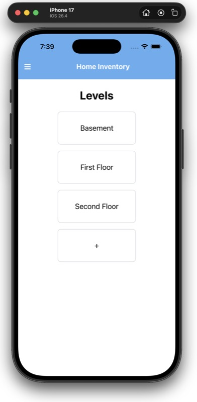

# Home Inventory app

A vibe-coded app for cataloging items in your home, such as heirlooms and antiques. Built using NativeScript and Vue. Includes use of the native camera and native tools for image resizing.

My current job prohibits the use of AI coding tools. So, I used this project as a way to learn how to use Claude Code. Other than creating the initial NativeScript project, all coding was done by Claude Code based on my prompts. Along the way, I learned how to add plug-ins and skills to Claude Code and create a project-level CLAUDE.md file. Prior to this project, I had never developed in NativeScript, though I'm comfortable with JavaScript/Typescript and Vue.

To run it, you will need to follow the [install steps for NativeScript](https://docs.nativescript.org/setup/). This will include the native mobile development toolchain for the platform you want to work with. In my case, that was XCode and an iOS Simulator plus some other requirements documented on the NativeScript site.

In the iOS case, run the simulator and app using `ns run ios --simulator`

